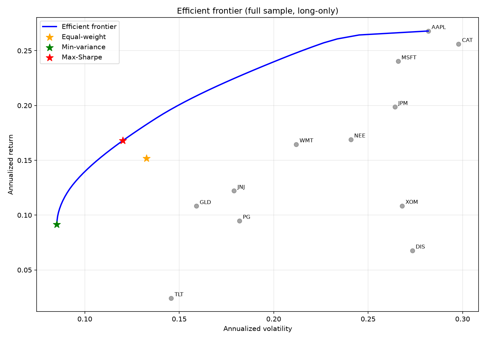
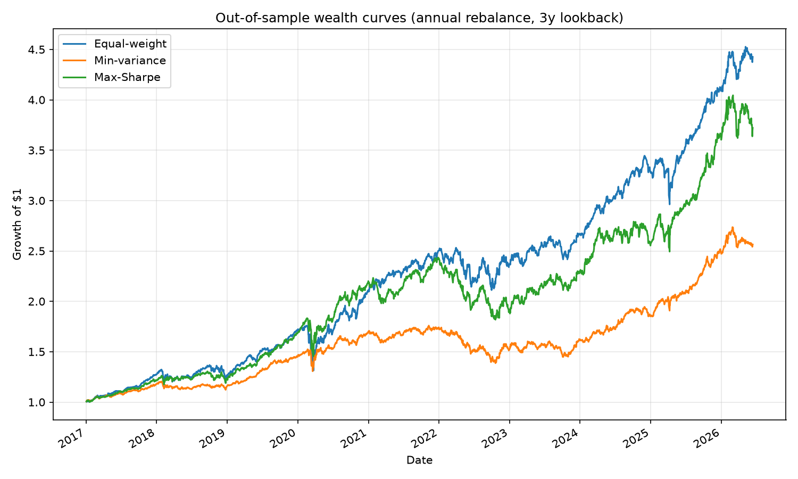

# Portfolio Optimization & the Efficient Frontier

Markowitz mean-variance optimization on a diversified 12-asset universe, with an
honest **out-of-sample** comparison of three allocation strategies:
equal-weight (1/N), minimum-variance, and maximum-Sharpe.

## Question

Modern portfolio theory says the max-Sharpe (tangency) portfolio is optimal.
But its inputs — expected returns and covariances — must be *estimated*, and
estimation error is large, especially for expected returns. **Does in-sample
optimality survive out-of-sample?** (Spoiler, consistent with DeMiguel,
Garlappi & Uppal 2009: usually not.)

## Data

Daily adjusted close prices from Yahoo Finance (2014–present) for 10 US large
caps spanning sectors (AAPL, MSFT, JPM, JNJ, PG, XOM, CAT, WMT, NEE, DIS) plus
TLT (long-term Treasuries) and GLD (gold) for diversification.

## Methodology

- **Optimization** (`optimization.py`): long-only weights, sum to 1, solved
  with scipy SLSQP. Min-variance minimizes portfolio variance; max-Sharpe
  maximizes (return − rf)/vol with rf = 2%. The efficient frontier traces the
  minimum-vol portfolio across a grid of target returns.
- **Backtest** (`backtest.py`): walk-forward with annual rebalancing. Weights
  for year *T* are estimated from daily returns over years *T−3 … T−1* only —
  no lookahead. Out-of-sample evaluation runs 2017–present.

## Results

| Strategy | Ann. return | Ann. vol | Sharpe | Max drawdown |
|---|---|---|---|---|
| Equal-weight | 17.1% | 14.1% | 1.08 | −25.3% |
| Min-variance | 10.5% | 9.6% | 0.89 | −21.2% |
| Max-Sharpe | 15.0% | 14.2% | 0.91 | −25.3% |

*(Run `python main.py` to regenerate with current data; numbers above are as
of June 2026.)*




## Key findings

1. **In-sample, the frontier dominates** every individual asset — the
   diversification math works exactly as theory predicts.
2. **Out-of-sample, naive 1/N beat max-Sharpe** (Sharpe 1.08 vs 0.91). The
   tangency portfolio's edge depends on expected-return estimates, which are
   so noisy over 3-year windows that the "optimal" weights are effectively
   optimized to past noise.
3. **Min-variance did what it promises**: lowest volatility (9.6%) and the
   smallest drawdown. Covariances are far easier to estimate than means, so
   the part of the optimization that *only* uses covariances holds up better
   out-of-sample.

## Limitations

- No transaction costs (annual rebalancing keeps turnover modest, but
  max-Sharpe weights can swing a lot between years — see
  `output/rebalance_weights.csv`).
- Constant 2% risk-free rate rather than the actual T-bill series.
- Sample-mean/sample-covariance estimators; shrinkage (Ledoit–Wolf) or
  Black–Litterman would be the natural next step.
- Survivorship bias: the universe was chosen today, not in 2014.

## Run it

```bash
pip install -r requirements.txt
python main.py
```

Outputs (charts + CSVs) are written to `output/`.
